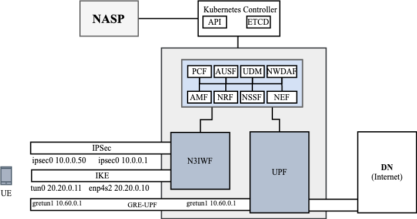
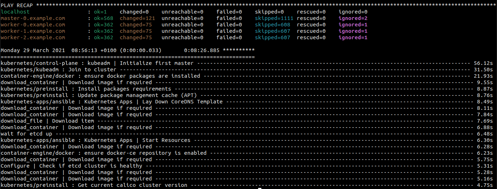
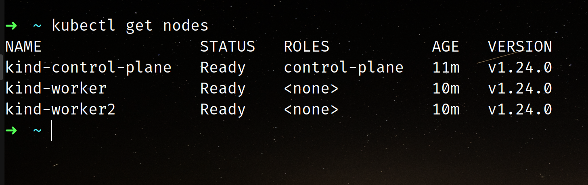
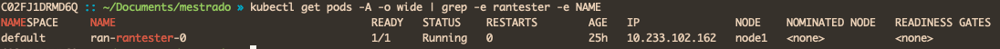
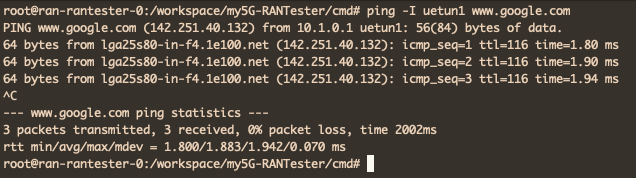

# 6G_Network_Slice_Install
This repository descries steps for innstalling the infrastructure and elements require to make up 6G Network Slice Platform (K8s Infrastructure + 5G Core + N3IWF + UEs Testers + NASP). The instalation process involves X diferrent major steps (Kubernetes Infrastructure + NASP + Run UEs). This project requires at least 2 linux machines.

Kubernetes Infrastructure:
2x
* SO: Ubuntu 22.04 (LTS) x64
* Uname -r >= 5.4.0-122-generic
* Memory: +8GB RAM
* Disk: 80GB

The steps described in this repository were performed based on a network topology similar to the one shown in the figure below:



## 6G Network Slice Components Installation
The installaltion step for each component are described below. Attention: All installation steps deescribed bellow should be executed with root privileges(SUDO SU).

----


### 1 - Kubernetes Infrastructure
**For Each Machine**
Get acces to any Ubuntu 22.04, with specified resources, and prepare the enviroment to the Platform installation

Install dwarves make and gcc
```bash
sudo apt install -y dwarves make gcc
```

Copy modules to BPF linux kernel
```bash
cp /sys/kernel/btf/vmlinux /usr/lib/modules/`uname -r`/build/
```

Get GTP5G
```bash
git clone -b v0.8.2 https://github.com/free5gc/gtp5g.git 
cd gtp5g && make clean && make && make install
```

**For Kubernetes Master Machine (ETCD Installed)**

Get acces to any Ubuntu 22.04, with specified resources, that you want to be a Cluster Master (etcd installed).
Access via terminal the machine where the 5GC will be executed and Run:

Install python3-pip annd python3-venv

```bash
apt install -y python3-pip python3-venv
```

Get Kubespray github:
```bash
git clone https://github.com/kubernetes-sigs/kubespray.git
```

Generate RSA KEY and paste to each **.authozired_keys** file in each machine
```bash
ssh-keygen -t rsa -C "$HOSTNAME" -f "$HOME/.ssh/id_rsa" -P ""
cat ~/.ssh/id_rsa.pub >> ~/.ssh/authorized_keys

cat ~/.ssh/id_rsa.pub
```

Prepare Kubespray packages
```bash
VENVDIR=kubespray-venv
KUBESPRAYDIR=kubespray
python3 -m venv $VENVDIR
source $VENVDIR/bin/activate
cd $KUBESPRAYDIR
pip install -U -r requirements.txt
```

Create Kubespray Inventory
```bash
cp -rfp inventory/sample inventory/mycluster
```

Declare Cluster IPS. **ATTENTION. Space separated**
```bash
declare -a IPS=(IP_1 IP_2 IP_3)
# should look like
# declare -a IPS=(10.116.0.3 10.116.0.2)
```

Create Inventory Configs 
```bash
CONFIG_FILE=inventory/mycluster/hosts.yaml python3 contrib/inventory_builder/inventory.py ${IPS[@]}
```

Enable Multus:
```bash
sed -e 's/kube_network_plugin_multus: false/kube_network_plugin_multus: true/' -i roles/kubespray-defaults/defaults/main.yaml  ; grep plugin_multus roles/kubespray-defaults/defaults/main.yaml
```

Enable IP Forward
```bash
sed -e 's/calico_allow_ip_forwarding: false/calico_allow_ip_forwarding: true/' -i roles/network_plugin/calico/defaults/main.yml ; grep forw roles/network_plugin/calico/defaults/main.yml
```

**RUN ANSIBLE***
```bash
ansible-playbook -i inventory/mycluster/hosts.yaml  --become --become-user=root cluster.yml
```

The Excepted output should be like this:



Connect to any machine and execute
```bash
kubectl get nodes
```

And the output should be like this::


----


## 2 - Observability on K8s components installation

Access via terminal a machine who has access to Kubernetes Cluster CTL. 
Check Kubernetes version:

```
sudo kubectl --version
```

Install HELM
```bash
curl -fsSL https://raw.githubusercontent.com/helm/helm/master/scripts/get-helm-3 | bash
````


Install Observability Helm Charts:

```
helm repo add grafana https://grafana.github.io/helm-charts
helm create ns grafana
helm install grafana -n grafana
```

Install Loki:

```
helm repo add loki https://grafana.github.io/helm-charts
helm create ns loki
helm install loki -n grafana
```

Install Linkerd:

```
# To add the repo for Linkerd stable releases:
helm repo add linkerd https://helm.linkerd.io/stable

# To add the repo for Linkerd edge releases:
helm repo add linkerd-edge https://helm.linkerd.io/edge

helm install linkerd-crds linkerd/linkerd-crds \
  -n linkerd --create-namespace
  
helm install linkerd-control-plane \
  -n linkerd \
  --set-file identityTrustAnchorsPEM=ca.crt \
  --set-file identity.issuer.tls.crtPEM=issuer.crt \
  --set-file identity.issuer.tls.keyPEM=issuer.key \
  linkerd/linkerd-control-plane
```


### 2 - Install NASP and connect to Kubernetes

In our local machine install python3, pip and poetry:

```
sudo apt install -y python3 python3-pip poetry
```

Clone this repository:

```
git clone https://github.com/fhgrings/NASP.git
```

Access NASP Python application:

```
cd NASP/nasp
```

Install and Update python packages:

```
poetry install --all
```

Run the following command to execute NASP Application with poetry environment:

```
poetry run flask run --debug
```

Copy .kube/config file from one of the kubernetes Machines and paste on 
```bash
./NASP/config/kubeconfig
```

**Then, access it from your browser:**

http://localhost:5000/nasp

#### 2º Load Data to the application

Download the example infrastructure require from the repository:

https://github.com/fhgrings/NASP/tree/main/helm_charts

Open the main *values.yaml* on Helm repo root directory

Update input values from required on infrastructure choosen and save the file:

```yaml
global:
  name: free5gc
  userPlaneArchitecture: single  # possible values are "single" and "ulcl"
  nrf:
    service:
      name: nrf-nnrf
      type: ClusterIP
      port: "8000"
      nodePort: "30800"
    nodeSelector:
  sbi:
    scheme: http
  amf:
    service:
      name: amf-n2
      port: 38412
      targetport: 31412
      protocol: SCTP
      type: NodePort
      n2:
```

Compress the entire folder

Upload the ZIP file to http://localhost:5000/nsst using the **Add Subnet Slice Template** button:


To run the UE copy the file from 
https://github.com/fhgrings/NASP/tree/main/helm_charts/rantester

Compress and import on NSST tab.


To Deploy it Create an NST using Free5GC as Core and RAN_Tester as RAN and UE.
After create, press Deploy NST.


### Test Slice and UE

To check where UE is located use the command
```bash
kubectl get pods -A -o wide | grep -e rantester -e NAME
````
 It should return something like:



To connect to the UE and run the network load tests use:
```bash
kubectl exec -it ran-rantester-0 -n {GIVEN_NAMESPACE} -- bash
```

After connected run
```bash
ping -I uetun1 www.google.com
````



