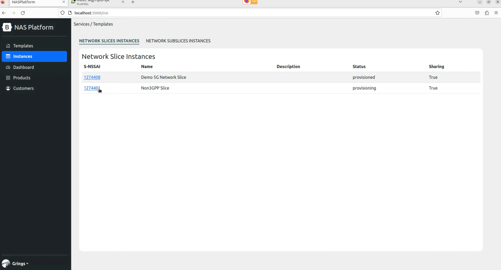

# 6G_Network_Slice_Install
This repository descries steps for innstalling the infrastructure and elements require to make up 6G Network Slice Platform (K8s Infrastructure + 5G Core + N3IWF + UEs Testers + NASP). The instalation process involves X diferrent major steps (Kubernetes Infrastructure + NASP + Run UEs). This project requires at least 2 linux machines.

Kubernetes Infrastructure:
2x
* SO: Ubuntu 22.04 (LTS) x64
* Uname -r >= 5.4.0-122-generic
* Memory: +8GB RAM
* Disk: 80GB

The steps described in this repository were performed based on a network topology similar to the one shown in the figure below:


## 6G Network Slice Components Installation
The installaltion step for each component are described below. Attention: All installation steps deescribed bellow should be executed with root privileges(SUDO SU).

----


### 1 - Kubernetes Infrastructure
**For Each Machine**
Get acces to any Ubuntu 22.04, with specified resources, and prepare the enviroment to the Platform installation

Install dwarves make and gcc
```bash
sudo apt install -y dwarves make gcc
```

Copy modules to BPF linux kernel
```bash
cp /sys/kernel/btf/vmlinux /usr/lib/modules/`uname -r`/build/
```

Get GTP5G
```bash
git clone -b v0.8.2 https://github.com/free5gc/gtp5g.git 
cd gtp5g && make clean && make && make install
```

**For Kubernetes Master Machine (ETCD Installed)**

Get acces to any Ubuntu 22.04, with specified resources, that you want to be a Cluster Master (etcd installed).
Access via terminal the machine where the 5GC will be executed and Run:

Install python3-pip annd python3-venv

```bash
apt install -y python3-pip python3-venv
```

Get Kubespray github:
```bash
git clone https://github.com/kubernetes-sigs/kubespray.git
```

Generate RSA KEY and paste to each **.authozired_keys** file in each machine
```bash
ssh-keygen -t rsa -C "$HOSTNAME" -f "$HOME/.ssh/id_rsa" -P ""
cat ~/.ssh/id_rsa.pub >> ~/.ssh/authorized_keys

cat ~/.ssh/id_rsa.pub
```

Prepare Kubespray packages
```bash
VENVDIR=kubespray-venv
KUBESPRAYDIR=kubespray
python3 -m venv $VENVDIR
source $VENVDIR/bin/activate
cd $KUBESPRAYDIR
pip install -U -r requirements.txt
```

Create Kubespray Inventory
```bash
cp -rfp inventory/sample inventory/mycluster
```

Declare Cluster IPS. **ATTENTION. Space separated**
```bash
declare -a IPS=(IP_1 IP_2 IP_3)
# should look like
# declare -a IPS=(10.116.0.3 10.116.0.2)
```

Create Inventory Configs 
```bash
CONFIG_FILE=inventory/mycluster/hosts.yaml python3 contrib/inventory_builder/inventory.py ${IPS[@]}
```

Enable Multus:
```bash
sed -e 's/kube_network_plugin_multus: false/kube_network_plugin_multus: true/' -i roles/kubespray-defaults/defaults/main.yaml  ; grep plugin_multus roles/kubespray-defaults/defaults/main.yaml
```

Enable IP Forward
```bash
sed -e 's/calico_allow_ip_forwarding: false/calico_allow_ip_forwarding: true/' -i roles/network_plugin/calico/defaults/main.yml ; grep forw roles/network_plugin/calico/defaults/main.yml
```

**RUN ANSIBLE***
```bash
ansible-playbook -i inventory/mycluster/hosts.yaml  --become --become-user=root cluster.yml
```

The Excepted output should be like this:


Install Kubectl
```bash
curl -fsSL https://packages.cloud.google.com/apt/doc/apt-key.gpg | sudo gpg --dearmor -o /etc/apt/keyrings/kubernetes-archive-keyring.gpg

echo "deb [signed-by=/etc/apt/keyrings/kubernetes-archive-keyring.gpg] https://apt.kubernetes.io/ kubernetes-xenial main" | sudo tee /etc/apt/sources.list.d/kubernetes.list

sudo apt update

sudo apt install kubectl
```

Connect to any machine and execute
```bash
kubectl get nodes
```

And the output should be like this::


----


## 2 - Observability on K8s components installation

Access via terminal a machine who has access to Kubernetes Cluster CTL. 
Check Kubernetes version:

```
sudo kubectl --version
```

Install HELM
```bash
curl -fsSL https://raw.githubusercontent.com/helm/helm/master/scripts/get-helm-3 | bash
````


Install Observability Helm Charts:

```
helm repo add grafana https://grafana.github.io/helm-charts
helm create ns grafana
helm install grafana -n grafana
```

Install Loki:

```
helm repo add loki https://grafana.github.io/helm-charts
helm create ns loki
helm install loki -n grafana
```

Install Linkerd:

```
# To add the repo for Linkerd stable releases:
helm repo add linkerd https://helm.linkerd.io/stable

# To add the repo for Linkerd edge releases:
helm repo add linkerd-edge https://helm.linkerd.io/edge

helm install linkerd-crds linkerd/linkerd-crds \
  -n linkerd --create-namespace
  
helm install linkerd-control-plane \
  -n linkerd \
  --set-file identityTrustAnchorsPEM=ca.crt \
  --set-file identity.issuer.tls.crtPEM=issuer.crt \
  --set-file identity.issuer.tls.keyPEM=issuer.key \
  linkerd/linkerd-control-plane
```


### 2 - Install NASP and connect to Kubernetes

In our local machine install python3, pip and poetry:

```
sudo apt install -y python3 python3-pip poetry
```

Clone this repository:

```
git clone https://github.com/fhgrings/NASP.git
```

Access NASP Python application:

```
cd NASP/nasp
```

Install and Update python packages:

```
poetry install --all
```

Run the following command to execute NASP Application with poetry environment:

```
poetry run flask run --debug
```

Copy .kube/config file from one of the kubernetes Machines and paste on 
```bash
./NASP/config/kubeconfig
```

**Then, access it from your browser:**

http://localhost:5000/nasp

#### 2º Load Data to the application

Download the example infrastructure require from the repository:

https://github.com/fhgrings/NASP/tree/main/helm_charts

Open the main *values.yaml* on Helm repo root directory

Update input values from required on infrastructure choosen and save the file:

```yaml
global:
  name: free5gc
  userPlaneArchitecture: single  # possible values are "single" and "ulcl"
  nrf:
    service:
      name: nrf-nnrf
      type: ClusterIP
      port: "8000"
      nodePort: "30800"
    nodeSelector:
  sbi:
    scheme: http
  amf:
    service:
      name: amf-n2
      port: 38412
      targetport: 31412
      protocol: SCTP
      type: NodePort
      n2:
```

Compress the entire folder

Upload the ZIP file to http://localhost:5000/nsst using the **Add Subnet Slice Template** button:


To run the UE copy the file from 
https://github.com/fhgrings/NASP/tree/main/helm_charts/rantester

Compress and import on NSST tab.


To Deploy it Create an NST using Free5GC as Core and RAN_Tester as RAN and UE.
After create, press Deploy NST.


After a few seconds the slice will appear as an instance on Instances Tab


### Test Slice and UE

To check where UE is located use the command
```bash
kubectl get pods -A -o wide | grep -e rantester -e NAME
````
 It should return something like:


To connect to the UE and run the network load tests use:
```bash
kubectl exec -it ran-rantester-0 -n {GIVEN_NAMESPACE} -- bash
```

After connected run
```bash
ping -I uetun1 www.google.com
````


The Dashboard Tabs should start to show the metrics data related to the instance


## Deploy Multiple Slices


## Troubleshootinng


## GTP5G
```
Skipping BTF generation for /root/gtp5g/gtp5g.ko due to unavailability of vmlinux
```
https://askubuntu.com/questions/1348250/skipping-btf-generation-xxx-due-to-unavailability-of-vmlinux-on-ubuntu-21-04

---
````
/tools/bpf/resolve_btfids/resolve_btfids: not found
````

You should be using Ubuntu 20.04+. Debian distros do not work properly with Free5gc GTP5G

---

## Kubernetes

AMF Logs 
````
Protocol Not Supported
````

Double Check SMTP properties in your CNI configs

---
````
XMFR Operation not permitted
````
N3IWF Container is not runnning with Privileged permissions.
Double check security Properties in Pod definition
Double check Container Runtime Permissions 

### 5GC

#### Network Functions Conflict 

The 5GC network functions are initialized through a `` ./run.sh ``. If, eventually, the connection with the terminal that initialized the .sh is closed improperly, the functions will continue running as loose processes on the execution stack. When trying to initialize the 5GC again, errors related to connection ports that are already in use will be triggered.
To solve the problem, just run `` ./force_kill.sh ``, is located in the same directory as the ``run.sh`` script. When executing  `` ./force_kill.sh `` all active processes related to the execution of the 5GC functions will be terminated and a new execution can be performed.

#### Conflict in the execution of 5GC API server

For a UE to be able to use the 5GC functionalities, it must be duly registered in the database. This record is performed through a [Rest API](https://github.com/LABORA-INF-UFG/Proto6G-Install#initializing-the-5gc-api-server) provided by the 5GC.
If eventually the terminal used to initialize the API is closed improperly, port 5000 will remain in use, preventing a new execution. In this case, the process must be terminated using kill -9 as described below:

* Find the PID of the process that is using port 50000: ``sudo netstat -nlp | grep :5000``
* Kill the process through the PID:: ``kill -9 <<PID-Nº>>``

#### Data inconsistency in 5GC MongoDB

In experimental scenarios, where the UE-non3GPP + 5GC connection procedures are repeated several times, it may happen that MongoDB persists inconsistent information. In these cases, it is interesting to delete the database and register the UEs again. To resolve the issue, perform the following steps:

* Terminate the execution of UE-non3GPP, N3IWF and 5GC.
* Access through a new terminal on the machine where 5GC was installed.
* Type in terminal `` mongo ``  to connect MongoDB CLI.
* In MongoDB CLI type `` use free5gc `` to connect to free5gc base.
* Type `` db.dropDatabase() `` to completely delete the 5gc database.

After deleting the database, [initialize 5GC](https://github.com/LABORA-INF-UFG/Proto6G-Install#initializing-the-5gc-functions), [initialize API Server](https://github.com/LABORA-INF-UFG/Proto6G-Install#initializing-the-5gc-api-server), [initialize N3IWF](https://github.com/LABORA-INF-UFG/Proto6G-Install#start-n3iwf), [register UE-non3GPP](https://github.com/LABORA-INF-UFG/Proto6G-Install#register-ue-non3gpp-into-5gc) and [test Proto6G components](https://github.com/LABORA-INF-UFG/Proto6G-Install#testing-proto6g-components).
